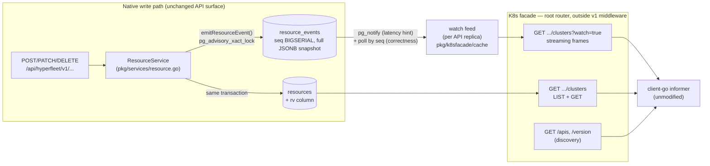

# POC: Kubernetes Controllers over HyperFleet API (List + Watch)

**Status: proof of concept.** Off by default (`k8s_facade.enabled: false`), read-only, zero impact on the existing REST API when disabled.

A stock **client-go / controller-runtime controller can LIST and WATCH HyperFleet resources unmodified**. The API now serves a Kubernetes-compatible read facade at `/apis/hyperfleet.openshift.io/v1alpha1` — discovery, list, get, and streaming watch with real resourceVersion semantics — backed by a transactional event outbox in PostgreSQL. No Kubernetes cluster, etcd, or CRDs involved; the facade is ~2k lines of Go inside the API itself.

Verified end-to-end in kind: a dynamic-informer controller ([`examples/facade-watch-controller/`](examples/facade-watch-controller/)) synced its caches against the facade and observed a full lifecycle driven through the *native* REST API:

```
ADD    clusters  manual-test-cluster rv=1  gen=1  reconciled=False        # POST /clusters
ADD    nodepools workers  rv=2  gen=1  namespace=<cluster-id>             # POST .../nodepools
UPDATE clusters  manual-test-cluster rv=3  gen=2                          # PATCH spec
UPDATE clusters  manual-test-cluster rv=4  gen=2                          # PUT /statuses — rv moves, gen doesn't
UPDATE nodepools workers  rv=5  gen=2  deletionTimestamp=...              # DELETE cluster → cascade soft delete
UPDATE clusters  manual-test-cluster rv=6  gen=3  deletionTimestamp=...
DELETE nodepools workers  rv=7                                            # force-delete → finalization
DELETE clusters  manual-test-cluster rv=8
ADD    channels  manual-test-channel rv=9                                 # POST /channels
DELETE channels  manual-test-channel rv=10                                # DELETE — hard-delete tombstone
```

`kubectl` works against it too: `kubectl api-resources`, `kubectl get clusters`, `kubectl get nodepools -A`, `kubectl get clusters -w`.

## Why

Everything downstream of this API **polls**. Sentinel polls lists for unreconciled resources; adapters fetch state after CloudEvents. The API had no watch because three primitives were missing:

1. **No resourceVersion.** `generation` and `updated_time` don't advance on adapter condition writes (they go to the `resource_conditions` child table), so no existing field could act as a change cursor — a poller keyed on either misses exactly the status transitions controllers care about most.
2. **No delete tombstones.** Kinds without required adapters (Channel, Version, WifConfig) are hard-deleted; the row vanishes and a consumer can never learn it existed.
3. **Streaming-hostile plumbing.** Every `/api/hyperfleet/v1` request runs under a ~30s context deadline (transaction middleware) plus gzip buffering; the server `WriteTimeout` can't be disabled.

The facade closes all three, which buys: event-driven controllers instead of poll loops (sub-second change propagation instead of poll-interval latency), no missed transitions, and the entire Kubernetes client ecosystem — informers, listers, workqueues, controller-runtime, kubectl — for free.

## Architecture



### Key design decisions

**Global sequence as resourceVersion.** Every mutation appends one row to `resource_events` — a `BIGSERIAL` seq plus a full JSONB snapshot of the resource — *in the same transaction* as the mutation (transactional outbox). The seq is the resourceVersion: globally ordered across all kinds, exactly the etcd-revision model Kubernetes clients assume. `resources.rv` denormalizes each resource's latest seq. Because seqs are allocated by the shared database, resourceVersions are portable across API replicas.

**Advisory lock closes the commit-order race.** `BIGSERIAL` alone is unsafe: seq 100 can become visible before seq 99 commits, so a watcher at 100 would permanently miss 99. The outbox insert takes `pg_advisory_xact_lock` (held until commit) immediately before allocating the seq, making allocation order equal commit-visibility order. An integration hammer test proves consumers never observe a gap that later fills in. Cost: mutations serialize on the insert→commit tail (~1/commit-latency ceiling) — fine for a control plane, revisit with an xid8 watermark if write rates grow.

**Tombstones via snapshots.** `DELETED` events carry the resource's final state and have no FK to `resources` — they outlive the row, so hard deletes are observable for the first time.

**Parent-as-namespace mapping.** Child kinds (NodePool, Version) are served as *namespaced* resources with the parent's ID as the namespace; top-level kinds are cluster-scoped. Native names are valid `metadata.name`s because the DB already enforces uniqueness per `(kind)` for top-level and `(kind, owner_id)` for children.

| Native | Kubernetes |
|---|---|
| `name` | `metadata.name` |
| `id` | `metadata.uid` + `hyperfleet.openshift.io/id` annotation |
| `owner_id` (child kinds) | `metadata.namespace` + `ownerReferences` |
| latest event seq (`rv`) | `metadata.resourceVersion` |
| `generation` | `metadata.generation` |
| `deleted_time` | `metadata.deletionTimestamp` + finalizer `hyperfleet.openshift.io/adapters` |
| `spec` (JSONB) | `spec` (passthrough) |
| `resource_conditions` | `status.conditions` (metav1.Condition shape) |

**Facade outside the v1 middleware chain.** Routes mount on the root router via a new `RegisterRootRoutes` hook, bypassing the request-timeout transaction middleware, gzip, and OpenAPI schema validation by construction — JWT auth still wraps the whole server. Watch handlers clear the per-connection write deadline (`http.ResponseController`), so no global timeout config changed.

**Deletion lifecycle maps onto K8s semantics.** Soft delete (kinds with required adapters) → `MODIFIED` with `deletionTimestamp` + a synthetic finalizer; adapter finalization or force-delete → `DELETED`. Exactly how a finalizing Kubernetes object behaves.

## What changed

| Component | Files |
|---|---|
| Event outbox migration (`resource_events`, `resources.rv`, notify trigger, backfill) | `pkg/db/migrations/202607201200_add_resource_events.go` |
| Event model + snapshot codec | `pkg/api/resource_event.go`, `Rv` field in `pkg/api/resource.go` |
| Outbox DAO (advisory-lock insert, `SafeHead`, replay, compaction) | `pkg/dao/resource_event.go` |
| Event emission on every mutation path (create/patch/delete trees/force-delete/adapter status) | `pkg/services/resource.go` |
| Facade: discovery, LIST/GET, streaming WATCH, object mapper, metav1.Status errors | `pkg/k8sfacade/` |
| Watch feed: outbox tail, LISTEN/NOTIFY wake-ups, fan-out, compaction janitor | `pkg/k8sfacade/cache/feed.go` |
| Plugin + root-router hook | `plugins/k8sfacade/plugin.go`, `cmd/hyperfleet-api/server/routes.go` |
| Config (`k8s_facade:` block) | `pkg/config/k8s_facade.go`, `configs/config.yaml.example`, chart `values.yaml`/`values.schema.json`/`templates/configmap.yaml` |
| Name lookups for K8s GET | `GetByName`/`GetByOwnerAndName` in `pkg/dao/resource.go` |
| Dependencies | `k8s.io/apimachinery` (prod), `k8s.io/client-go` (tests only) |
| Demo controller + kind test scripts | `examples/facade-watch-controller/` |

Notably **not** changed: the TypeSpec spec repo (the facade emits K8s wire shapes, not OpenAPI-generated types), the native REST API surface, and default behavior — the facade is opt-in.

## What it gives us — and current limits

**Works today:** client-go dynamic/unstructured informers (list→watch→resync loop, 410-triggered relist), kubectl (discovery, get, `-w`, jsonpath), label selectors (equality + set-based) and field selectors (`metadata.name`/`metadata.namespace`) on list *and* watch — including `DELETED` delivery when an object's labels leave a watch's selector — watch replay from any retained resourceVersion, bookmarks, per-event condition changes (the thing no existing cursor could see), and multi-replica-consistent resourceVersions.

**Not yet:** writes through the facade (read-only POC), protobuf negotiation, `limit`/`continue` chunked lists (full lists returned — permitted by the K8s contract, client-go copes), `sendInitialEvents`. Two rare selector-transition edge cases on watches started from an old RV heal at the client's next relist. Full list in [docs/k8s-facade.md](docs/k8s-facade.md#known-limitations).

## How to test

### 1. Full demo in kind (~5 min after image build)

Prereqs: `podman`, `kind`, `kubectl`, `helm`, `go`.

```bash
cd examples/facade-watch-controller/scripts
./00-setup.sh          # kind cluster + API via helm chart (facade on) + demo controller + port-forward
./10-lifecycle-test.sh # drives the native REST API, prints the watch events the controller received
./99-teardown.sh       # deletes everything (add --images to also remove built images)
```

`10-lifecycle-test.sh` output should match the event table in the TL;DR: two `ADD`s, a generation-bumping `UPDATE`, a condition-only `UPDATE` (rv moves, generation doesn't), cascade soft-delete `UPDATE`s with `deletionTimestamp`, `DELETE`s on finalization, and a hard-delete tombstone for the Channel.

### 2. Poke at it directly

```bash
# Raw watch frames (ADDED/MODIFIED/DELETED/BOOKMARK), one per line:
./20-watch-raw.sh clusters          # live from "now"
./20-watch-raw.sh clusters 0        # replay current state first
./20-watch-raw.sh clusters 1        # replay history; a compacted RV returns 410 Gone

# kubectl against the facade (writes scripts/facade-kubeconfig):
./30-kubectl-facade.sh
kubectl --kubeconfig facade-kubeconfig get clusters -w

# Drive events from another terminal via the native API:
curl -X POST http://localhost:18000/api/hyperfleet/v1/clusters \
  -H 'Content-Type: application/json' \
  -d '{"kind":"Cluster","name":"demo","spec":{"provider":"gcp","region":"us-east1"}}'

# Watch the controller react live:
kubectl -n hyperfleet logs deploy/facade-watch-controller -f
```

### 3. Automated suites

```bash
make test-integration
```

Relevant suites under `test/integration/`:

| Suite | Proves |
|---|---|
| `resource_events_test.go` | one event per mutation, condition-only changes bump rv not generation, tombstones; a concurrent-writer hammer proving gap-free seq ordering through the real HTTP path |
| `k8s_facade_test.go` | discovery shapes, LIST/GET, selectors, namespacing, metav1.Status errors, soft-deleted visibility |
| `k8s_facade_watch_test.go` | streaming lifecycle, RV replay, bookmarks, `timeoutSeconds`, selector-transition DELETED, 410 on compacted history |
| `k8s_informer_test.go` | a real client-go dynamic informer syncing and tracking add/update/delete against the facade |

## Productionization gaps

- **Write path** (would make the facade a full K8s API): resourceVersion compare-and-swap on update, `/status` subresource, K8s→native conversion with admission-equivalent validation (reusing `validators.SchemaValidator`), name↔ID mapping on create.
- **Observability**: feed lag, active-watch, and events-broadcast metrics; today only structured logs.
- **Scale**: keyset `continue` pagination for very large kinds; advisory-lock write ceiling (revisit with an xid8-watermark scheme); `resource_events` retention sizing under adapter condition churn (writes are deduplicated by a JSON-equality check, but flapping adapters still amplify).
- **Chart ergonomics**: `image.registry` has no default, which surprises local installs.

## Further reading

- [docs/k8s-facade.md](docs/k8s-facade.md) — full reference: endpoints, mapping semantics, watch protocol details, kubeconfig examples, limitations
- [examples/facade-watch-controller/README.md](examples/facade-watch-controller/README.md) — the demo controller and test scripts
- [configs/config.yaml.example](configs/config.yaml.example) — the `k8s_facade:` configuration block
